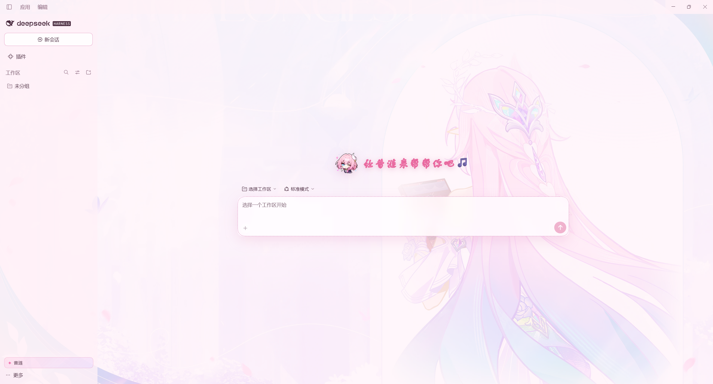
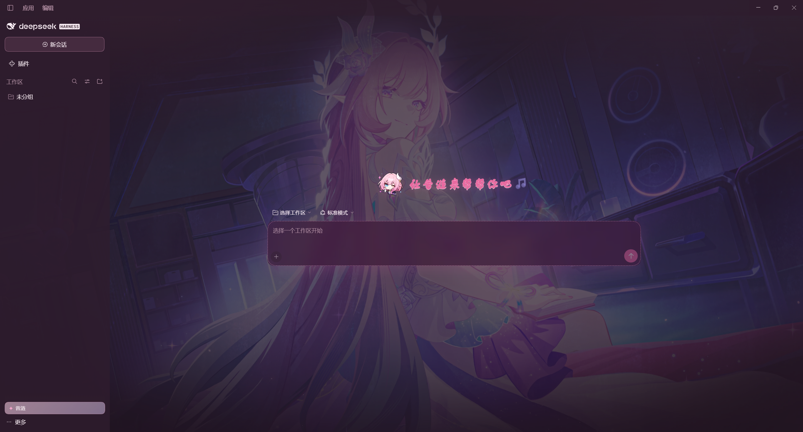

# dsh-cyrene-theme · 昔涟主题

把 DSH Web GUI 换成《崩坏：星穹铁道》昔涟（Cyrene）的粉白渐变毛玻璃主题，把 agent 的人格设定改成昔涟——人格提示词可以直接在侧边栏里改——让她在该有情绪的时候贴一张自己的表情包，把新会话欢迎页的鱼换成她、顺手把输入框的默认提示换成她的话，还能把整页背景换成 `Background/` 里放的那几张图（可以在面板里开关、选起点、自动轮换）。

> **English** — A pink-and-white frosted-glass skin for the DSH Web GUI, themed after Cyrene from *Honkai: Star Rail*. It also rewrites the agent persona (editable from the sidebar), teaches the agent to post Cyrene reaction stickers, replaces the new-session hero fish with her, and adds a full-page background picker (enable / pick / rotate / fade the images in `Background/`).
>
> Install: `dsh plugin --profile web add github:berhbro/dsh-cyrene-theme` — then reload the page. UI text is Chinese.
>
> **Unofficial fan project.** Cyrene and all *Honkai: Star Rail* character art, names and assets are © miHoYo / HoYoverse, used here as non-commercial fan work. Not affiliated with or endorsed by miHoYo, HoYoverse or DeepSeek — see 「版权与致谢」 below.

## 能力

| 部分 | 实现 |
| --- | --- |
| 主题 UI | 客户端半注入一份作用域化样式表（`body[data-dsh-cyrene][data-cyrene-skin="on"]`）：整体渐变背景、半透明表面 token、`backdrop-filter` 毛玻璃、粉色描边与柔和阴影、粉色滚动条/选区。全部随插件卸载自动还原。`--dsw-alias-bg-base` 被设成 `transparent`，所以渐变由 `body::before` 铺满视口；桌面版窗口带原生材质（`backgroundMaterial: "acrylic"`），因此 `html` 画布上也补了一层不透明底色，避免整窗透出系统模糊。 |
| 人格设定 | 宿主半注册 `systemPrompt.section({ name: 'cyrene:persona', order: 部署人格前缀 order + 100 })`——运行版 `dsh-system-prompt` 的键是 `DEPLOYMENT_PERSONA_PREFIX`(0)，旧版是 `DEPLOYMENT_PERSONA`(0)，两个都试；都取不到就落到 `100`，仍然排在通用人格之后、工具策略 `PLAN_POLICY`(500) 之前。每次保存后重挂这个 section，所以**改完立刻对之后每一轮对话（含新对话）生效**，不需要重载插件。section 名用本包自己的 `cyrene:persona`，绝不占用保留名 `deployment:persona`（那是 `@deepseek-ai/dsh-persona` 的位置，全局重名注册会直接失败）。 |
| 侧边栏编辑 | 客户端半向 `sidebar.footer.action` 注册「✦ 昔涟」按钮（点开浮动面板），并额外向 `settings.section` 注册一整页「昔涟 · 主题」，两处用的是同一个编辑器。 |
| 表情包 | 素材放在包内 `meme/` 下（文件名就是表情名字），`stickers.json` 是清单（id / 名称 / 什么时候用 / 文件）。宿主半把清单折算成一段附在人格之后的「【表情包】」说明——**每张图的绝对路径整行写好**，模型直接照抄（路径里带括号、空格或非 ASCII 时，自己拼很容易抄错）——并开两条只读路由：`GET /cyrene/stickers`（清单，支持 `?reload=1`）与 `GET /cyrene/sticker/<id>`（图片字节，带 `ETag`/304）。设置页里能看到缩略图与「允许发表情包」开关；关掉后这段说明就从系统提示词里消失。 |
| 表情包管理 | 面板里只有一行**入口**（「✦ 表情包管理　N 张」+「打开管理器」），点开是一整页**管理器**（挂在 `body` 上的覆盖层，Escape 或右上「关闭」退出）：里面**加图**（选文件 → 转成 data URL → `POST /cyrene/stickers`）、**删图**（只删自己加的，`POST /cyrene/stickers/remove`）、**调大小**（48–240px 滑杆，落进 `state.stickerSize`）。页面本身封顶 + 内层滚动，素材不会撑出管理器范围。自添加的图落在 `stickers-custom/`（gitignore，属运行时数据），条目存在状态文件的 `customStickers` 里，与包内清单合并成同一份「【表情包】」说明——**加完立刻能贴**，不用重载插件行。 |
| 背景图 | `Background/` 文件夹是唯一真相：宿主半扫描它（`GET /cyrene/backgrounds`，支持 `?reload=1`）、按文件名把字节发出去（`GET /cyrene/background/<文件名>`，与表情包同一套响应头）。客户端半在 `body` 上挂一层 `.cyre-bg`（`position:fixed;inset:0;z-index:-1;pointer-events:none`）：两层图交叉淡入 + 一层色纱，有图时铺满视口；**整列对话区不刷白**，照片直接透上来，只把用户气泡的底色调厚、再给正文一圈淡光晕。控制板里「背景图 / 简约（无图）」二选一、点缩略图选起点、开自动轮换（15–3600 秒）、拖浓度（0.2–0.85）。详见「背景图」。 |
| 持久化 | 宿主半自带 fenced 路由 `/cyrene/state`（GET 读 / POST 写），落盘到 `$DSH_HOME/cyrene-theme.json`（默认 `~/.dsh/cyrene-theme.json`）。写入走**乐观并发**：写请求必须带上 GET 拿到的 `rev`，缺 `rev`（旧版客户端半 / 手搓脚本）→ 400 `client-outdated`，`rev` 过期 → 409 `stale` —— 没刷新的旧页面不可能再把别处的改动盖回去。 |
| 对话界面 | **新会话欢迎页**：客户端半占用 `conversation.hero.brand.mark` 这个单占位槽（官方 brand 包不占它，默认渲染才是那个动态鱼），改成昔涟的整张贴纸（带 alpha 的 Q 版立绘，不画边框底盘）+ 一句粉白渐变艺术字欢迎语，整行是纯装饰（点不响、选不中、拖不动）；贴纸字节走宿主半的 `GET /cyrene/hero`，图片路径来自 `state.hero.image`。**输入框占位提示**：原生那句写在 `[data-composer-placeholder]` 的文本节点里、没有 i18n 覆盖的口子，所以用纯 CSS（把原字染透明 + 自己的 `::after` 写一句「有问题？有任务？来找昔涟♪」）替换，不动 DOM、不碰宿主词典。**悬浮毛玻璃**：输入框卡片的 `backdrop-filter` 画在 `::before` 上而不是卡片本身，否则会破坏发送键那个未开 portal 的 fixed Tooltip 的定位、鼠标停上去时界面闪烁（详见「已知坑」）。详见「对话界面微调」。 |

## 安装

从本地目录（开发时就地改）：

```powershell
dsh plugin --profile desktop add D:\dshWorkPlace\dsh-cyrene-theme
```

从 GitHub（`--profile` 换成你自己的 profile 名，Web 端一般是 `web`，桌面端是 `desktop`）：

```powershell
dsh plugin --profile desktop add github:berhbro/dsh-cyrene-theme
```

装完刷新一次页面：客户端半的 bundle 是页面加载时读的，不刷新还是旧的。（`files` 里已包含 `Background/`、`meme/`、`stickers.json`，所以从 GitHub 装也带素材。）

卸载：`dsh plugin --profile desktop remove dsh-cyrene-theme`。

## 截图

浅色主题（`the-longest-night.jpeg`）与新会话欢迎页：



深色主题（`night-reading.jpeg`）：



给插件市场用的截图清单在同目录的 [`screenshots.json`](screenshots.json)（市场会读它，不读本页；放哪几张、什么顺序都由它定）。

## 使用

1. 安装后刷新一次 DSH 页面——客户端半是新 bundle，不刷新不会加载。
2. 侧边栏最下方、设置按钮旁边点「✦ 昔涟」打开人格设定面板（Esc 或右上角 ✕ 关闭）。
3. 也可以在「设置 → 昔涟 · 主题」里打开同一份编辑器。
4. 编辑框里写的就是人格底稿；点「保存设定」后，之后每一轮对话都会以这段设定回答。三个开关分别是**昔涟人格**、**粉白毛玻璃主题**、**允许发表情包**（"重新载入"会把表情包清单重新拉一遍）。
5. 下面一行「✦ 表情包管理」是唯一的入口，点「打开管理器」跳出一整页：**大小**滑杆拖动时先就地预览、松手才落盘；**添加**一行填「名字 / 什么时候贴」再选张图（png / jpg / gif / webp / avif，单张 ≤8MB）即可；自己加的那些卡片角上有「✕ 删除」，包内的那 11 张删不了（改 `stickers.json` 才是它们的入口）。
6. 再下面一行是背景：先是「背景图 / 简约（无图）」二选一——选**简约**就回到没加背景图之前那种样子（渐变底 + 素着的对话列），再右边是「自动轮换」；下面两个滑杆是**间隔**（15–600 秒）与**淡化**（0.2–0.85，越大照片越淡、正文越清楚）；「下一张」只是当场翻页（不写状态文件），点缩略图才把那张定为起点。图片丢进 `Background/`，加删图刷新页面即可认。
7. 「恢复默认」把默认底稿填回编辑框（还要点一次保存才生效），「重新载入」丢弃未保存的改动（表情包清单与背景清单一起重拉）。

### 改完之后什么时候生效

| 改的是什么 | 生效方式 |
| --- | --- |
| 人格底稿 / 开关 / 背景设定（在面板里保存） | **立刻**，之后每一轮对话都按新设定；旧对话也一样 |
| `lib/client.js`（样式表、面板本身） | 刷新页面（F5）——客户端半是页面加载时读的 bundle |
| `lib/index.js`（路由、section 逻辑） | 重载插件行或重启 DSH——宿主半在 DSH 启动时载入后一直缓存 |
| `cordis.patch.yml` | 重载插件行或重启 DSH |
| `hero.image` / 欢迎语（状态文件或 `DEFAULT_HERO`） | 重载插件行或重启 DSH（宿主半启动时读一次） |
| `Background/` 里加图 / 删图 / 改名 | **刷新页面即可**——页面每次都会带 `reload=1` 让宿主重扫那个目录，不需要动宿主半 |
| 手工改状态文件里的 `background` | 重载插件行或重启 DSH |

本插件以 `link:` 方式装在工作区里，所以**改文件不需要重装**，但上面这张表仍然成立。
如果保存时看到「这个页面还是旧版本，请按 F5 刷新后重试」，就是页面里的客户端半比宿主的 `rev` 旧了一代：刷新一下即可。

## 状态文件

```json
{ "persona": "……人格提示词……", "enabled": true, "theme": true, "stickers": true,
  "stickerSize": 96, "customStickers": [],
  "hero": { "image": "meme/俏皮眨眼.png", "title": "让昔涟来帮帮你吧🎵" },
  "background": { "enabled": true, "current": "", "rotate": false, "interval": 90, "dim": 0.6 },
  "rev": 3 }
```

- `persona`：空字符串表示不注入人格。
- `enabled`：人格总开关。
- `theme`：粉白主题开关（关掉只留人格，UI 回到原样）。
- `stickers`：表情包开关（关掉后那段「【表情包】」说明不注入）。
- `stickerSize`：聊天里贴图的最大边长（px），落盘前夹在 48–320 之间。它**不跟主题开关走**——贴图大小是插件设定，关掉主题也照样生效。
- `customStickers`：面板里自添加的表情包（`{ id, file, label, when }`，`file` 只是 `stickers-custom/` 下的文件名，越界或类型不认识的一律丢弃）。
- `hero`：新会话欢迎页的**形象路径**（相对插件目录，只认包内的图片）与**欢迎语**。形象读不出来（文件不在 / 类型不认识 / 超过 8MB）时 `GET /cyrene/state` 里的 `hero.ready` 是 `false`，页面就只显示欢迎语、不挂坏图；改完要重载插件行或重启 DSH 才认（宿主半只在启动时读一次磁盘）。
- `background`：整页背景。`enabled` 是总开关（还要求主题开关也是开着的），`current` 是起点文件名（**空字符串＝按目录顺序的第一张**；填的名字不在 `Background/` 清单里也不会出事，只是被当作没指定），`rotate` 是自动轮换，`interval` 是轮换间隔秒数（落盘前夹在 15–3600），`dim` 是色纱浓度（夹在 0.2–0.85，越大越淡）。非字符串、带 `/` `\` `..` 的 `current` 一律保持原样不写。
- `rev`：写入版本号，每次成功写入 +1。手工编辑这个文件时把 `rev` 一起调大（或直接删掉这行）即可；留着小值会让还开着旧版本的页面写不进来（那正是它存在的意义）。

出问题时最快的还原手段：删掉这个文件并重载插件行，人格回到内置默认、主题按默认值。

## 表情包

素材（11 张，`meme/`）与清单（`stickers.json`）都在包里，清单是唯一真相：

```json
{ "version": 1, "dir": "meme", "maxPerTurn": 1,
  "items": [ { "id": "happy", "label": "超开心", "file": "meme/超开心.png",
               "when": "事情成了、她真的替你高兴的时候", "note": "……" } ] }
```

- `dir` 相对包根，`file` 相对插件目录；**只认包内的文件**（越界的路径会进 `missing`，不会被执行）。
- 文件名就是表情名字（`超开心.png`、`点赞.jpeg`……）——文件名跟着 `label` 走，原始的时间戳/哈希名已经用 `node tools/rename-stickers.mjs` 改掉了（先 `--dry` 看一眼）。加新图时把文件丢进 `meme/`、在清单里按同样的命名写好 `file`，再跑一次这个脚本就能对齐；改名失败会整批回滚，不会留下"文件改了、清单没改"的半截状态。
- 换图/加图只改清单——插件本体不用重装，页面刷新一次即可（宿主半要重载插件行才认新文件，见上面那张生效表）。
- 一张图超过 8MB、或扩展名不在 `png/jpg/jpeg/gif/webp/avif` 里，也会进 `missing` 并在 `GET /cyrene/stickers` 的响应里报出来。

模型是怎么"知道"这些图的：宿主半把清单拼成一段文字，**追加在人格底稿之后**（同一段系统提示词 section，所以在同一个 `enabled` 开关之下、独立于 `stickers` 开关）。里面每张图都是一行可以直接复制的 Markdown：

```markdown
- 超开心｜事情成了、她真的替你高兴的时候 → 
```

规矩也写在里面：**最多 `maxPerTurn` 张、只在情绪真的到了的时候贴、代码/命令/报错/技术结论旁边不贴、拿不准就不贴**，而且必须单独占一行（`dsh-client-ui-chat` 只把独立成行的图片渲染成预览，混在句子里的图片路径会原样显示）。

图片本身由客户端半的预览网格与 `GET /cyrene/sticker/<id>` 提供：**页面是 http 来源，`file://` 的本地路径在页面里根本加载不出来**，所以缩略图必须走宿主半的字节路由（宿主半读磁盘、带 `Content-Type`/`Content-Length`/`ETag`）。而模型粘贴在回复里的那一行用的是**文件绝对路径**——那是聊天面板自己的 Markdown 图片解析（按"当前查看的工作区"解析本地路径），跟浏览器同源策略无关。

### 面板里自己加表情包

设置页那一行「✦ 表情包管理」只是个入口，点「打开管理器」会弹出一整页覆盖层（挂 `document.body` 上、Escape 或右上「关闭」退出；插件没有自己的路由，这是"跳转到对应页面"在本环境里的等价物）。页面里：填「名字 / 什么时候贴」→ 选文件 → 「添加」。上传路径是 `POST /cyrene/stickers`，body 是 `{ rev, name, label, when, data }`，`data` 是浏览器 `FileReader` 读出来的 `data:image/*;base64,…`：

- 页面本身**不会让素材溢出去**：覆盖层 `max-height` + `overflow:hidden`、宽 `min(560px, calc(100vw - 48px))`；里面 `.cyre-manager-scroll` 才是滚动层（`flex:1 1 auto;min-height:0`）；卡片锁 `min-width:0;max-width:100%;overflow:hidden`，长名字只换行不撑格子。`test/client.smoke.mjs` 里有专门盯这条的正则断言。

- 请求体上限放宽到 **12MB**（普通写入口还是 256KB），解码后超过 `MAX_ASSET_BYTES`（8MB）回 400 `too-large`；`data` 不是 data URL 回 400 `bad-image`；mime 与文件名后缀都不在 `png/jpg/jpeg/gif/webp/avif` 里回 400 `bad-type`。
- 扩展名**优先信 data URL 里的 mime**（浏览器给的最准），认不出来才退回文件名后缀。
- 成功时：写文件到 `stickers-custom/<id><ext>` → 条目推进 `state.customStickers` → `rev+1` 落盘 → 重新解析清单 → **重挂人格 section**，所以刚加的图这一轮就能贴。响应回 `{ state, stickers }` 两个快照，面板一次刷新到位。
- 删除走 `POST /cyrene/stickers/remove`（body `{ rev, id }`），按 id 找条目、从磁盘 `rm` 文件、同样 `rev+1` 并重挂人格；id 认不出来（包括 `../../…` 这种写法）一律 404 `not-found`，不会碰到目录外的任何东西。
- 自添加的图**不放 `$DSH_HOME`**：聊天里的贴图是 Markdown 图片，本地路径按"当前查看的工作区"解析，所以文件必须在工作区内读得到，才落在插件目录的 `stickers-custom/`（已 gitignore，属运行时数据）。

### 贴图大小

聊天里的贴图就是 Markdown 图片，DOM 是 `button[class*="_imageButton"] > img[class*="_image"]`，宿主自己那条 `[class*="_imageButton"] [class*="_image"]{max-width:min(100%,640px);max-height:360px}`。我们不跟它抢源码，而是**按 `alt` 认自己的图**：

```css
body[data-dsh-cyrene]{--cyre-sticker-size:96px}
body[data-dsh-cyrene] img[alt^="昔涟·"]{max-width:var(--cyre-sticker-size);max-height:var(--cyre-sticker-size);width:auto;height:auto}
```

- 认 `alt` 而不是 `src`：`alt` 是「昔涟·<名字>」，由 Markdown 原样保留，`src` 会被宿主按工作区重写。特异度 (0,2,2) 高于宿主的 (0,2,0)，不需要 `!important`。
- `--cyre-sticker-size` 由客户端半在 `applySkin()` 里按 `state.stickerSize` 写到 `body` 上；拖动滑杆时先就地改变量做预览、松手（`change`）才 `save({ stickerSize })`。
- 这条规则**故意不带 `data-cyrene-skin`**：关掉主题也照样管大小。

## 背景图

素材就放在 `Background/`（包内目录，图自己丢进去就行）。宿主半把它当唯一真相：启动时扫一遍，另有 `GET /cyrene/backgrounds`（带 `?reload=1` 强制重扫）回清单、`GET /cyrene/background/<文件名>` 回字节——**只有清单里有的名字才发**，其余一律 404。它跟表情包共用同一套响应头（`ETag`/304、`Cache-Control: private, max-age=300`、`nosniff`），单张上限 24MB，扩展名按 `ASSET_TYPES` 认。

### 叠了三层

| 层 | 是什么 | 什么时候在 |
| --- | --- | --- |
| 渐变底 | `body::before`（粉白 / 紫夜渐变）+ `body::after`（顶部珠光） | 主题自带的，一直都在 |
| `.cyre-bg` | 两层图片交叉淡入 + 一层色纱 | 有图时才铺满视口，没图整层 `display:none`，渐变照旧露出来 |
| 对话内容 | 有图时把用户气泡的底色（`--dsw-specific-bubble`）调厚一点，再给正文（段落 / 列表 / 表格）一圈很淡的光晕 | 背景图开着时才挂上；**整列本身不刷白**，照片直接透上来 |

`.cyre-bg` 是 `body` 的真实子元素，`position:fixed;inset:0;z-index:-1;pointer-events:none`：不占布局、不接指针，任何点击都到不了它；树序排在 `body::before` 之后，所以有图时它盖住渐变，`body::after` 那层珠光仍在最上面。

三件事同时成立才会铺出来：**主题开关开着**、风格选的是「背景图」、`Background/` 里至少有一张能用的图。所以关掉主题就等于连同背景图一起收掉（渐变底回来），不用担心深色/浅色主题和背景图色调打架。

### 对话区为什么不刷白、也不用毛玻璃

早先的版本给 `[data-conversation-scroll]` 铺了一层 90% 的白纸来"把对话和背景分开"，结果照片基本看不见了——现在整列保持透明，只对**对话本身**做处理：有图时把用户气泡的底色调厚一点，再给正文一圈很淡的光晕（段落 / 列表 / 表格；预格式化的代码块自带深色底，不参与）。照片该看见就看见，字也压得住。

另外，**绝不能给 `[data-conversation-scroll]` 加 `backdrop-filter`。** 输入框卡片是它的后代，而发送键那个 Tooltip 没开 portal、气泡是 `position:fixed`——滚动容器一旦因为 `backdrop-filter` 成为 fixed 后代的包含块，就会重新触发「鼠标停在发送键上界面闪烁」那个 bug。要是觉得照片太抢眼，把「淡化」往上拖——那层色纱才是真正管"照片有多淡"的旋钮。

### 轮换只发生在页面里

`rotate` 打开后，客户端半按 `interval` 秒在页面里换下一张，**不写状态文件**——`current` 是你点的那张起点，轮换只管"这一会儿看哪张"。所以刷新页面后一定回到你选的那张，而不是上次轮换停在哪。「下一张」同理，只是当场翻页。`dim` 越大色纱越厚：浅色主题偏粉白、深色主题偏紫夜，免得正文压在亮部或暗部上读不动。

两张自带素材正好一明一暗：`the-longest-night.jpeg` 是浅色主视觉（配浅色主题），`night-reading.jpeg` 是深蓝夜景（配深色主题）。文件名只是排序用的，想换成自己的图就直接丢进 `Background/`（认 `png/jpg/jpeg/gif/webp/avif`，单张上限 24 MB），刷新页面就能在缩略图条里看到。

## 对话界面微调

这两处不跟主题开关走（主题关掉也还在，因为它们是"昔涟在这儿"的标识，不是皮肤的一部分）。

### 新会话欢迎页的形象与欢迎语

那个"新会话里的鲸鱼"是 `@deepseek-ai/dsh-client-ui-conversation` 里 `HeroShell` 的内置兜底：鱼来自槽位 `conversation.hero.brand.mark` 的 `fallback`，旁边的内置文案是 i18n 键 `hero.headline`（zh「探索未至之境」）。官方 brand 包**不占用**这个槽位（它的注释里写着 "The conversation hero stays on its declaring package's animated fish fallback"），所以这是个空着的单占位槽，直接注册就能接管。

这一行的 DOM 随宿主构建改过两次，选择器要同时兼容（类名哈希前缀每次构建都会变，所以一律按 `[class*="_xxx"]` 匹配）：

- 运行版（asar）：`div[class*="_headline"]`（flex 行，`gap:12px 10px`）里依次是槽位外壳 `span[class*="_fishHitbox"]`（`flex:none`）和 `span[class*="_titleGroup"]`；内置文案是 `titleGroup` 里一个**没有 class** 的 `span`，带 class 的那个是「预览版」徽标。
- 早一些的构建（profile store 里的 0.1.2-rc.1）：`div[class*="_headline"]` 是 `grid-template-columns:34px auto auto` 的 grid（鱼 / 文案 / 徽标），内置文案带 `_headlineText`。

客户端半注册 `conversation.hero.brand.mark`（单占位契约，只传 `{ name }`，不带 id/order），渲染：

- `img.cyre-hero-mark`：72px 高的**贴纸**形象，`src` 指向宿主半的 `GET /cyrene/hero`——**页面是 http 来源，`file://` 在这里加载不出来**，所以字节必须由宿主半发（`ETag`/304、`Cache-Control: private, max-age=300`、`nosniff`）。素材直接用 `meme/` 里本来就有透明通道的 Q 版立绘（`DEFAULT_HERO.image`，默认 `meme/俏皮眨眼.png`），**页面这边什么都不再画**：没有 `border`、没有底盘、没有 `border-radius`、没有 `mask-image`，抠好的轮廓自己就是边界，和背景之间没有过渡痕迹——就是"把图单独扣出来贴上去"。唯一加的是一层 `drop-shadow`（跟着 alpha 轮廓走，不是方框影），让她像贴纸一样落在页面上；不想要就删掉那一行。
  - **为什么不能拿方形裁切的 JPEG 去抠**：`meme/IMG_20260612_155829.jpg` 那张特写里，皮肤和头发高光的亮度跟白底差不多（`floor>=240` 且 `max-min<=14` 也拦不住），洪水填充要么把脸挖出洞、要么留着方框；而且她的头发在左 / 右 / 下三条边都跑出画外，抠完那三条边是齐的。要换这类素材得手工修，或者用 `tools/hero-cutout.py` 调参数慢慢试。
  - 加载失败或宿主说 `ready:false` 时这一格直接不渲染，只留欢迎语。
  - **整行是纯装饰**：`.cyre-hero` 上写着 `pointer-events:none`（点不响，连 `:hover` 都不会触发）、`user-select:none` + `-webkit-user-select:none`（文字选不中）、`cursor:default`（不出现手型光标），`img` 另加 `-webkit-user-drag:none` 与 React 的 `draggable:false`（浏览器里拖不出影子）。`[class*="_headline"]:has(.cyre-hero)` 这一层也同样设了 `pointer-events:none` + `user-select:none`，免得宿主那层槽位外壳把点击接走。这几条都会被子元素继承。
- `span.cyre-hero-title`：艺术字欢迎语。字体栈 `FZShuTi（方正舒体）/ YouYuan（幼圆）/ STHupo（华文琥珀）`，末尾一定收在 `Microsoft YaHei UI / 微软雅黑 / system-ui / sans-serif`——**不留衬线兜底**，免得某个字重的字体没命中时掉回宋体那一类。文字用 `background-clip:text` 走**粉 → 白**的渐变（`linear-gradient(168deg,#ff7cbb,#ffa9d0 34%,#ffd8ea 68%,#fff7fc)`），白尾部分在白底上会飘，所以描一圈 1.1px 的粉边（`-webkit-text-stroke:1.1px #e8699f`）+ 一层浅粉投影把它托住；**不支持渐变裁字时有纯色兜底**（`@supports not (background-clip:text)`）。末尾那个音符（`♪ ♫ 🎵 🎶`）会被拆成单独的 `span.cyre-hero-note` 轻轻晃动，`prefers-reduced-motion: reduce` 时不动。
- 挑字体有个看得见的对照图：`python tools/hero-preview.py` 会在粉白渐变底上用实际配色画出「让昔涟来帮帮你吧♪」的六个候选字体（幼圆 / 华文琥珀 / 方正舒体 / 华文新魏 / 华文行楷 / 微软雅黑），输出 `tools/hero-font-preview.png`。改字栈只要改 `.cyre-hero-title` 的 `font-family`。
- 大小有对照图：`python tools/hero-mock.py [素材路径]` 按页面的真实渐变（`body::before` 那五层）与 2 倍尺寸画出「贴纸 + 艺术字」整行，形象高度做成 64 / 72 / 88 三档，输出 `tools/hero-mock.png`。现在 CSS 用的是 72px。
- 同时用 CSS 把内置那句藏掉，并把官方那枚「预览版」徽标一起收掉（这一行只留头像 + 艺术字）：
  ```css
  [class*="_headline"]:has(.cyre-hero){grid-template-columns:auto}          /* grid 那版：别把 64px 头像压进 34px 那格 */
  [class*="_headline"]:has(.cyre-hero) [class*="_headlineText"],
  [class*="_headline"]:has(.cyre-hero) [class*="_titleGroup"] > span:not([class]){display:none}
  [class*="_headline"]:has(.cyre-hero) [class*="_previewBadge"]{display:none}
  ```

想换图：把新图丢进 `meme/`，改状态文件里的 `hero.image`（或让插件作者改 `DEFAULT_HERO`），然后重载插件行 / 重启 DSH。想换欢迎语：改 `hero.title`。

### 输入框的默认占位提示

`InputBar` 先把文案算出来：`placeholder ?? (parentOffline ? … : disabled ? … : canSteerQueue ? … : planActive ? … : t("placeholder.default"))`，然后**同一段文案写两个地方**——contenteditable 上的 `data-placeholder` 属性，和紧随其后的 `div[data-composer-placeholder]` 的**文本节点**（两者是 `div[class*="_grow"]` 里的紧邻兄弟；占位 div 的 CSS 是 `position:absolute;inset:4px 8px auto 14px`）。i18n 词典是单占位命名空间，重复 `register` 会直接 throw，所以**不能**靠注册词典覆盖；也没有任何 `attr(data-placeholder)` 的 CSS 在用它。

于是做法是纯 CSS，而且**闸门开在兄弟节点的 `data-placeholder` 前缀上**——只替换"默认"与"欢迎页默认"这两种文案，其他状态提示（会话不可用 / 父会话已离线 / 排队插话 / 计划模式 / 选择工作区）原样保留：

```css
/* 原字隐形；但它仍然是文本节点、仍然占着宽度，所以不能直接往后接一句 */
body[data-dsh-cyrene] [data-composer-input][data-placeholder^="发消息或创建任务"] + [data-composer-placeholder],
body[data-dsh-cyrene] [data-composer-input][data-placeholder^="描述你想要构建的内容"] + [data-composer-placeholder],
body[data-dsh-cyrene] [data-composer-input][data-placeholder^="Message or run a task"] + [data-composer-placeholder],
body[data-dsh-cyrene] [data-composer-input][data-placeholder^="Describe what you want to build"] + [data-composer-placeholder]{color:transparent}
/* ::after 的规则同上四行，只多一个 ::after；新文案绝对定位钉回容器左上角，
   那正是原字的起点，也就和输入的文字同一个左边距（欢迎页那版容器是
   display:-webkit-box + 两行 clamp，跟随流排版还会被顶到第二行上去） */
… + [data-composer-placeholder]::after{
  content:"有问题？有任务？来找昔涟♪";
  position:absolute;left:0;top:0;text-align:left;white-space:nowrap;
  font-family:"Microsoft YaHei UI","微软雅黑","PingFang SC","Hiragino Sans GB","Noto Sans SC",system-ui,sans-serif;
  font-size:inherit;line-height:inherit;
  color:var(--dsw-alias-label-caption, rgba(120,90,110,.78));
}
```

`left:0` 是相对那个**已经 `position:absolute`** 的占位 div 自己算的（`inset:4px 8px auto 14px`），所以新文案的起点和输入框里文字的左内边距（`padding:4px 8px 0 14px`）天然对齐；`overflow:hidden` 也仍然是那个 div 在管，超长会照旧被裁掉。

被替换掉的两个原生前缀（运行版实读）：`placeholder.default` = 「发消息或创建任务, / 调用指令, @ 文件或对话」、`placeholder.hero` = 「描述你想要构建的内容, / 调用指令, @ 文件或对话」（en 对应 `Message or run a task…` / `Describe what you want to build…`）。宿主改了文案就只是不再命中、原样显示，不会坏。

新文案只有一个来源：`lib/client.js` 顶部的 `PLACEHOLDER_TEXT`（写进 CSS 模板里）。它只在输入框为空、且没有待处理队列时才出现。

## 取证旁路（诊断用）

桌面外壳的活页面在受限沙箱里既截不了图、也没有 DOM 读取通道，皮肤出现视觉问题时只能让页面自己说。所以客户端半每 5 秒扫一遍 `body` 下的元素，把「带 `backdrop-filter` 的」和「面积 ≥15% 视口且背景半透明的」报给宿主：

```
POST /cyrene/report   # 页面 → 宿主，只存内存，不落盘
GET  /cyrene/report   # 读回最后一份报告（含上报时间）
```

报告是旁路：不带 `rev`、不碰状态文件、超 128KB 直接 400 拒收，任何一步失败都只影响诊断。报告形如：

```json
{ "kind": "cyrene-dom-report", "theme": true, "viewport": [1600, 900], "blurCount": 3,
  "entries": [ { "el": "div[data-shell-overlay]", "blur": "blur(16px) saturate(160%)", "bg": "rgba(0,0,0,0)", "alpha": 0, "share": 100, "rect": [0,0,1600,900], "position": "absolute", "visibility": "visible", "zIndex": "20" } ] }
```

用 `curl http://127.0.0.1:19387/cyrene/report` 就能看到「当前页面上到底是谁在发糊」。皮肤稳定之后这一路可以整段删掉（客户端半的 `REPORT_*` / `collectReport` / `pushReport` 与那个 `dom report` effect，宿主半的 `/report` 分支）。

## 与其他皮肤共存

本包的作用域是 `body[data-dsh-cyrene]`，别的皮肤（例如 `maid-atelier` 的 `body[data-dsh-maid-atelier]`）会同时生效。两者都开时 token 会互相竞争（本包选择器多一个属性，同 token 上通常占优），但背景图/装饰仍可能叠加，视觉会乱——建议同一时间只开一个。

不过在这台机器的 desktop profile 里，`maid-atelier` 只是 `node_modules` 里的残留依赖，**并不在 `dsh.profile.bundles` 或任何 patch 里，宿主半的路由也不存在**（`GET /skin-assets/` 返回 404），所以实际上并没有第二个皮肤在跑。想清干净可以：`dsh plugin --profile desktop remove @smalltailqwq/dsh-client-ui-skin-maid-atelier`。

## 已知坑

- **不要给 `[data-shell-overlay]` 加 `backdrop-filter`。** 它是 `@deepseek-ai/dsh-client-ui-layout` 里 AppFrame 的 overlayLayer（`.BynINW_overlayLayer{z-index:20;pointer-events:none;position:absolute;inset:0}`），**永远存在且铺满整帧**；给它加模糊，整个窗口都会跟着发糊。浮层要打毛玻璃就打它的直接子元素（`[data-shell-overlay] > *`）。`test/client.smoke.mjs` 里有专门盯这条的回归断言。
- 桌面窗口是 Electron 的原生 acrylic 材质，它"拥有"窗口级的模糊。所以 `--dsw-alias-bg-base: transparent` 必须配一层不透明的画布底色，否则系统模糊会从整扇窗透出来。
- **不要把 `backdrop-filter` 打在 `[data-composer-card]`（输入框卡片）本身上。** 发送键外面套着一个 `@deepseek-ai/dsh-client-ui-primitives` 的 `Tooltip`，它**没有开 `portal`**（别处如 `queue.save` 开了），气泡是 `position:fixed` 且要等 ResizeObserver 量到尺寸后才做视口适配。而按 CSS 规范，元素一旦有 `backdrop-filter` 就会成为 **fixed 后代的包含块**、同时形成层叠上下文——气泡的视口定位被破坏，适配逻辑就会反复换边，表现就是**鼠标停在发送键上时界面闪烁**（`delayMs:500`，正好对上"停留"）。要保留卡片的通透感，就把毛玻璃画在静态伪元素上：`[data-composer-card]{isolation:isolate}` + `[data-composer-card]::before{content:"";position:absolute;inset:0;z-index:-1;border-radius:inherit;backdrop-filter:blur(16px) saturate(160%)}`（宿主的 `.v1kfCW_panel:before` 就是这套写法）。`test/client.smoke.mjs` 里有断言专门盯"卡片自己身上不许出现 `backdrop-filter`"。
- **不要给 `[data-sidebar-right-panel]` 加 `backdrop-filter`。** 它是 `@deepseek-ai/dsh-client-ui-sidebar-right` 里的右侧栏容器（`.OUqwTW_panel{pointer-events:none;flex-direction:column;min-width:0;display:flex;position:absolute;top:0;bottom:0;right:0}`）：自身没有背景，收起时只是把窗格 `[data-dockkit-host=dock]` 设成 `visibility:hidden`（**布局宽度仍在**）。给它加模糊，那块区域会一直保持模糊——表现就是"打开设置页后右半边发雾，关掉也不散"。毛玻璃要打在真正的窗格 `[data-dockkit-pane]` / `[data-dockkit-float]` 上（它们收起时不被绘制）。同样有回归断言盯着。
- **不要给 `[data-conversation-scroll]` 加 `backdrop-filter`。** 同一个道理：输入框卡片就在这个滚动容器里面，而发送键那个 Tooltip 是它的后代且是 `position:fixed`——容器一变成包含块，就会重新触发上面那条"停在发送键上闪烁"。所以整页背景图开着时对话区**整列不刷白**，只把用户气泡的底色调厚、给正文一圈淡光晕。`test/client.smoke.mjs` 里有回归断言盯着这条。

## 自检

```powershell
node test/host.smoke.mjs
node test/client.smoke.mjs
node test/contrast.mjs
```

`host.smoke.mjs` 99 项断言，全部跑在临时目录里（脚本自己把 `DSH_HOME` 指过去，不碰真实的 `~/.dsh`）：section 名与 order 回退、默认底稿、`/cyrene/state` 的信封与响应头、落盘与跨"重启"读回、重挂 section 的 disposer 语义、`enabled=false` 与空白 persona、404、超过 256KB 的请求体，**rev 乐观并发**（缺 rev 400、过期 rev 409 且不改状态、成功写入 rev+1、重启后旧 rev 依然被拒、`lastWrite` 诊断记录被拒的尝试），**取证旁路**（`POST /cyrene/report` 存内存、`GET` 读回、超 128KB 400 拒收且不覆盖上一份、全程不碰 `rev`/状态/磁盘），**表情包**（清单解析出 11 项且都能取到字节、`Content-Type` 与长度对得上、缓存与 `nosniff` 头、未知 id 404、`stickers:false` 之后系统提示词里不再有「【表情包】」并落盘、再打开回来），以及**欢迎页形象**（`/cyrene/state` 里的 `hero` 四项、`GET /cyrene/hero` 回真图字节、缓存/nosniff/`ETag`、带对 `ETag` 回 304、改欢迎语立即生效且落盘、`../` 越界与不存在的文件都只是 `ready:false` 而不是 500、改回默认后重新就绪），以及**表情包管理**（新装的状态文件带 `stickerSize: 96` 与空 `customStickers`；上传成功回 `{state, stickers}` 两个快照、清单里那一项 `custom: true` 且 `label`/`when` 原样保留、新图能从 `/cyrene/sticker/<id>` 读回同样长度的字节、条目落盘、人格 section 立刻含新名字与时机；上传同样受 rev 闸门管、非 data URL 400 `bad-image`、类型不认识 400 `bad-type`、解码后超 8MB 400 `too-large` 且磁盘不留东西；`stickerSize` 9999→320 / 10→48 / 128.4→128 并落盘；删除后清单为空、文件也没了、人格附录不再提它；删不存在的 id（含 `../../etc/passwd` 这种写法）404 `not-found`），以及**背景图**（`/cyrene/state` 里的 `background` 五项默认值、清单回 `{ error, folder: 'Background', items }` 且每项 `url` 正好是 `/cyrene/background/<encodeURIComponent(id)>`、字节路由的长度/类型/缓存/`nosniff` 头、未知名字与 `..%2F..%2Fpackage.json` 都只是 404、脏值补丁被夹住或原样保留（`dim 5→0.85`、`interval 3→15`、`enabled:'no'` 不动、`current:'../outside.jpeg'` 不动）、正常补丁确实落盘、改回默认）。

`client.smoke.mjs` 121 项断言，用最小 DOM / react / fetch 桩在 node 里把客户端 bundle 跑一遍：loader 注册与导出、6 个 effect、样式表注入与带 `data-plugin-css`、body 作用域与卸载还原、三个槽位的 name（含欢迎页单占位槽不带 id/order）、按宿主状态打 `data-cyrene-skin`、宿主不可达时仍能装上；**回归项：毛玻璃不落在整帧 overlay 层本身上、不落在右侧栏容器 `[data-sidebar-right-panel]` 上、只落在浮层的直接子元素与真正的窗格 `[data-dockkit-pane]`/`[data-dockkit-float]` 上、html 画布有不透明兜底**；**取证扫描的挑选逻辑**、**取证通道的自我修复**（宿主半还没有这条路由时开机照样上报、被 404 拒收后下一拍重试、内容没变就不重复上报）、**表情包管理器**（编辑器里只剩一行入口：一句「N 张」概况 + 「打开管理器」按钮，内嵌网格/滑杆/诊断复选框都不在了；点入口弹出覆盖层再按清单渲染卡片、`img.src` 指向宿主半的字节路由而不是 `file://`、点「关闭」后覆盖层真的从 `body` 上摘掉、表情包开关默认按宿主值、关掉只发自己那个字段）；**对话界面微调**（欢迎页的头像与艺术字规则、**头像是一整张贴纸：不画边框/底盘/圆角/遮罩、直接用素材自己的 alpha**、**整行纯装饰：`pointer-events:none` + `user-select:none` + `cursor:default`，`img` 另带 `-webkit-user-drag:none` 与 `draggable:false`**、藏掉内置文案的两种落点与官方「预览版」徽标、`:has()` 收成单列、艺术字的字栈以方正舒体打头且**收在无衬线**（同时断言样式表里不会出现行楷/楷体/`serif`）、粉 → 白渐变的确切色标与粉边、`prefers-reduced-motion`、占位提示的 `color:transparent` + `::after` 文案、**`::after` 必须 `position:absolute;left:0` 钉在容器左上角**且明写无衬线字栈、闸门只认"默认/欢迎页默认"两个前缀且没有无闸门的写法、状态类提示没被写进规则、以及欢迎页组件首帧真的渲染出指向 `/cyrene/hero` 的 `img`、音符合 `🎵` 被拆成单独 span、宿主说 `ready:false` 时不挂坏图）；并且**真的把设置页组件跑起来**驱动编辑器——开关改动只发自己那个字段（不再回写缓存快照）、保存按钮只提交改过的 persona、每次写入都带上宿主的 rev、收到 409 后自动重新载入并按宿主的值回正开关；**表情包管理器页**——诊断复选框已经从编辑器里取消（也不在管理器里）；大小滑杆按宿主值回显、拖动（`input`）只改 CSS 变量不落盘、松手（`change`）才 `save` 且**只发 `stickerSize` 这一个字段**；没选文件时「添加」禁用、选文件后可点、上传 POST 带 `rev`/`name`/`label`/`when`/`data`（data 以 `data:image/png;base64,` 开头）、上传成功后网格多一张且只有自添加的那张带「删除」按钮与 `data-id`、点删除走 `/cyrene/stickers/remove` 并带上 id 与 rev、删完编辑器入口那句概况也跟着回到「2 张」；以及**回归：卡片自己身上不许有 `backdrop-filter`（只能画在 `::before` 上）、毛玻璃组齐全且已经不再挂诊断闸门、`--cyre-sticker-size` 与 `img[alt^="昔涟·"]` 两条贴图大小规则、管理器不会让素材超出页面范围（外层封顶 + 内层滚动 + 卡片锁宽）**；以及**背景图**——`.cyre-bg` 层里铺好两层交叉淡入的图与一层色纱、并且是 `position:fixed` + `z-index:-1` + `pointer-events:none`（不占布局、不接指针）、对话列纸面确实有圆角与底色、**回归：`[data-conversation-scroll]` 上不许出现 `backdrop-filter`**；清单请求带 `reload=1`、`--cyre-bg-dim` 与 `data-cyre-bg` 跟着宿主状态走、缩略图 2 张且 `src` 指向字节路由而不是 `file:`、起点那张带 `data-on="1"` 且真的铺在图层上、概况行显示张数；关开关**只发 `{ background: { enabled: false } }` 这一个键**、点缩略图发 `{ background: { current } }` 且高亮与图层一起换、**「下一张」和自动轮换都不写宿主**（这段里没有任何 POST 体含 `"current"`）、浓度拖动只改 CSS 变量与标签、松手才落盘**。

`contrast.mjs` 31 项断言，从 `lib/client.js` 里抠出本包写下的 `--dsw-alias-*` token，把半透明面板 alpha 合成到渐变背景上（取粉最浓、层最透的最不利一角），算 WCAG 对比度：正文 10.7:1（浅）/12.1:1（深），次级与说明文字 ≥4.5:1，语义状态色 ≥3:1（error / warn-label ≥4.5:1），自绘主按钮上的字 ≥4.5:1。**为了过这些线，浅色主题的 brand 填充、caption/tertiary/deep-diving、state-\* 都比纯"糖果粉"深了一档**——粉色仍然在，只是不再是白字压浅粉那种读不清的搭配。

## 版权与致谢

- **代码**：本仓库的代码（宿主半、客户端半、自检脚本、工具脚本）以 **MIT** 许可发布，见 [`LICENSE`](LICENSE)，可以自由使用、修改、再分发。
- **角色与美术素材**：昔涟（Cyrene）以及《崩坏：星穹铁道》的角色形象、名称与美术素材，版权归**米哈游（miHoYo / HoYoverse）**所有。`meme/`、`Background/` 里的图片，以及界面上出现的角色相关文字，都是本主题的**二次创作 / 同人使用**，不是官方素材发布，也不代表官方立场。
- **非官方**：这是一个爱好者作品，与米哈游、HoYoverse、DeepSeek 及其关联方**没有隶属、合作或背书关系**。主题**免费、非商业**：不售卖、不含付费内容，素材只用于美化本地界面。
- **侵权请联系删除**：如果权利人认为本仓库中任何素材的使用不妥，请在本仓库的 [Issues](https://github.com/berhbro/dsh-cyrene-theme/issues) 里说明，我会在收到通知后**尽快删除相应素材**，必要时连同整个仓库一起下线。
- **致谢**：主题、人格与表情包文案的灵感来自《崩坏：星穹铁道》与昔涟；插槽与样式约定来自 DeepSeek Harness 的插件体系。感谢官方把这些做得足够好看，也感谢把它开放到能被改造的程度。

> **In English** — Code: MIT (see `LICENSE`). Cyrene and all *Honkai: Star Rail* character art, names and text are © miHoYo / HoYoverse; everything under `meme/` and `Background/` is non-commercial fan work, not official assets. This is an unofficial fan project with no affiliation, partnership or endorsement from miHoYo, HoYoverse or DeepSeek. Rights holders: open an [issue](https://github.com/berhbro/dsh-cyrene-theme/issues) and the assets — or the whole repository — will be removed promptly.

## 目录

```
dsh-cyrene-theme/
  package.json          dsh.bundle.patch + dsh.client（platform: web）
  cordis.patch.yml      插件树插入声明
  lib/index.js          宿主半（ESM）：系统提示词 section + /cyrene/state 路由 + 落盘 + 表情包清单/字节路由 + 表情包上传/删除 + /cyrene/hero + 背景清单/字节路由
  lib/client.js         客户端半（手写 CJS bundle，无需构建）：样式表 + body 作用域 + 三个槽位 + 界面微调 + 整页背景层与对话内容的可读处理 + 设置面板 + 独立的表情包管理器页
  Background/           整页背景图素材（自带 the-longest-night.jpeg 浅色 / night-reading.jpeg 深蓝夜景；宿主启动时扫一次，页面每次带 reload=1 强制重扫）
  stickers.json         表情包清单（id / 名称 / 时机 / 文件），换图只改这里
  meme/                 表情包素材（11 张，jpeg/png，文件名＝表情名字）
  stickers-custom/      面板里自添加的表情包（运行时数据，已 gitignore；不在仓库里）
  LICENSE               MIT
  screenshots.json      给插件市场看的截图清单（在 package.json 旁边，市场读它；不进 npm 包）
  docs/screenshots/     市场截图（LightTheme.png / DarkTheme.png，只在仓库里，不进 npm 包）+ 拍摄说明
  tools/rename-stickers.mjs  按清单把素材文件改名（`--dry` 先看，失败整批回滚）
  tools/show-stickers.mjs    把清单渲染成人眼可读的「【表情包】」段
  tools/hero-preview.py      画出欢迎页艺术字的候选字体对照图（预览用，不参与运行）
  tools/hero-mock.py         画出「贴纸 + 艺术字」整行的大小对照图（预览用）
  tools/hero-cutout.py       把白底方形素材抠成透明 PNG（给没有透明通道的素材用）
  test/host.smoke.mjs   宿主半自检（node 直接跑，无需依赖）
  test/client.smoke.mjs 客户端半自检（stub DOM/react/fetch）
  test/contrast.mjs     主题 token 的 WCAG 对比度自检
```
